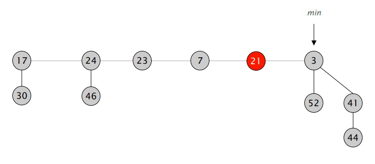
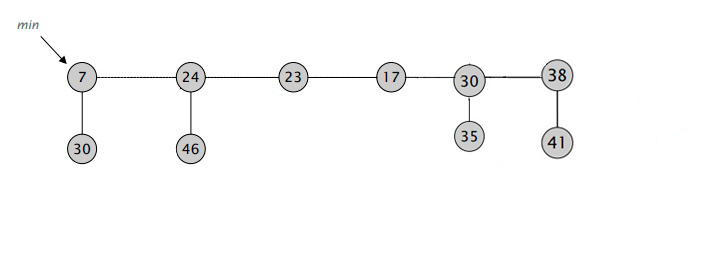
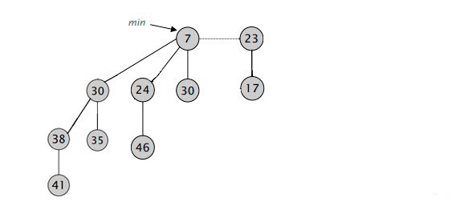

### МИНИСТЕРСТВО НАУКИ И ВЫСШЕГО ОБРАЗОВАНИЯ РОССИЙСКОЙ ФЕДЕРАЦИИ
### Федеральное государственное автономное образовательное учреждение высшего образования
## Дальневосточный федеральный университет
***
### Институт математики и компьютерных технологий
### Департамент информационных и компьютерных систем
### Отчёт о практическом задании по предмету АИСД
# Алгоритм Дейкстры с использованием Фибоначчиевой кучи
***
### Коканов Александр Владиславович, гр. Б9121-09.03.03пикд
### г. Владивосток, 2022

# Содержание
* [*Содержание*](#содержание)  

* [*Глоссарий*](#глоссарий)  

* [*Введение*](#введение)  
    * [*Применение*](#применение)
    * [*Авторство*](#авторство)

* [*1. Алгоритм Дейкстры*](#алгоритм-дейкстры)  
     * [*1.1. Описание алгоритма*](#описание-алгоритма)
     * [*1.2. Варианты реализации алгоритма Дейкстры*
](#варианты-реализации-алгоритма-дейкстры) 
* [*2. Фибоначчиева куча*](#фибоначчиева-куча)  
    * [*2.1. Определение Фибоначчиевой кучи*](#fib-min_)
    * [*2.2. Операции, поддерживаемые Фибоначчиевой кучей*](#операции-поддерживаемые-фибоначчиевой-кучей)  
        * [*2.2.1. Вставка элемента*](#Insert)
        * [*2.2.2. Слияние*](#Merge)
        * [*2.2.3. Уменьшение элемента*](#decrease-key)
        * [*2.2.4. Удаление минимума*](#remove-minimum)
    * [*2.3. Доказательство времени работы*](#доказательство-времении-работы)  
        * [*2.3.1. Вставка элемента*](#Insert-math)
        * [*2.3.2. Слияние*](#Merge-math)
        * [*2.3.3. Уменьшение элемента*](#decrease-key-math)
        * [*2.3.4. Удаление минимума*](#remove-minimum-math)
    * [*2.4. Преимущества и недостатки*](#преимущества-и-недостатки)
* [*3. Реализация алгоритм Дейкстры с помощью Фибоначчиевой кучи*](#реализация-алгоритм-дейкстры-с-помощью-фибоначчиевой-кучи)  

* [*4. Список литературы*](#список-литературы)  

# Глоссарий
<strong id="graph"> Граф</strong> — структура данных, отображающая связи между разными объектами. Состоит из множества вершин и множества соединяющих их рёбер. 

<strong id="vertex"> Вершина</strong> — точка в графе, отдельный объект. Может иметь некоторые характеристики, в частности, число, поставленное в соответствие данной вершине и называемое весом, стоимостью или пропускной способностью вершины.

<strong id="edge"> Ребро</strong> — неупорядоченная пара двух вершин, которые связаны друг с другом. Эти вершины называются концевыми точками или концами ребра. Ребро также может иметь вес.

<strong id="path"> Путь</strong> — последовательность вершин, в которой каждая вершина соединена со следующей ребром. Обычно путь задаётся перечислением вершин, по которым он пролегает.

<strong id="oriented-edge">Ориентированное ребро</strong> — ребро, в котором одну вершину считают началом ребра, а другую — концом.

<strong id="connected-graph">Связный граф</strong> — граф, в котором существует путь между любыми двумия вершинами.

<strong id="weighted-graph">Взвешенный граф</strong> — граф, в котором у каждого ребра и / или каждой вершины есть вес

<strong id="tree">Дерево</strong> — стандартная структура данных, являющаяся связным графом, в котором нет ни одного пути, где начальная и конечная вершина совпадают (цикл). 

<strong id="descendant">Потомок</strong> — потомком вершины $my_vector$ называется такая вершина $u$, что в неё заходит ребро, исходящее из вершины $my_vector$ 

<strong id="parent">Предок</strong> — предком вершины $my_vector$ называется такая вершина $u$, что из неё исходит ребро, заходящее в $my_vector$

<strong id="tree-Root">Корень дерева</strong>  — вершина, не имеющая предка

<strong id="tree-Rank">Ранг дерева</strong> — количество рёбер, исходящих из корня дерева. 

<strong id="array">Массив</strong> - упорядоченный набор элементов, каждый из которых хранит одно значение, идентифицируемое с помощью одного или нескольких индексов.

<strong id="bin-min_">Двоичная (бинарная) куча</strong>  — дерево, в котором выполняется 3 условия: 
1) при этом значение в любой вершине не больше, чем значения её потомков. 
2) у каждой вершины не более двух [*потомков*](#descendant) 
3) слои заполняются последовательно сверху вниз и слева направо, без пропусков. 

<strong id="list">Двусвязный циклический линейный список</strong> — стандартная структура данных, состоящая из элементов, содержащих значение и ссылки на следующий и предыдущий элемент списка. При этом начальный элемент содержит ссылку на конечный элемент, и наоборот.

<strong id="asymptotics">Асимптотическая сложность алгоритма</strong> -  время и память, которые понадобятся программе в процессе работы, обычно обозначется с помощью "О большого",  математического способа приблизительной оценки функции. Запись выглядит следующим образом: $O(1)$ - константная сложность (не завясящая от входных данный), $O(n)$, где $n$ - размер структуры данных, - линейная сложность (максимальное количество действий равно $n$).

<strong id="Indicator">Указатель</strong> — переменная, диапазон значений которой состоит из адресов ячеек памяти или специального значения — нулевого адреса.

<strong id="amortized_analysis">Амортизационный анализ</strong> — метод подсчета времени, требуемого для выполнения последовательности операций над структурой данных. При этом время усредняется по всем выполняемым операциям, и анализируется средняя производительность операций в худшем случае. Такой анализ чаще всего используется, чтобы показать, что даже если некоторые из операций последовательности являются дорогими, дешёвые операции компенсируют затраты дорогих.

# Введение

## Неформальная постановка задачи

- Необходимо осуществить реализацию алгоритма в отдельных заголовочных файлах
- Необходимо осуществить методы взаимодействия с алгоритмом
- Необходимо математически установить и доказать асимптотическую оценку алгоритма и определить, на каких задачах он будут максимально эффективным
- Определить соответствует ли время работы реализованного алгоритма теоритической оценке

## Применение
1) Картографические сервисы. 
Алгоритмы нахождения кратчайшего [*пути*](#path) на [*графе*](#graph) применяются для нахождения путей между физическими объектами на таких картографических сервисах, как карты _Google_ или _OpenStreetMap.
2) Маршрутизация движения данных в компьютерной сети. 
3) Расчет движения тока по электрическим цепям.
4) Поиск системой бронирования наиболее быстрых или дешевых билетов, в том числе с возможными пересадками;
5) Разработка поведения неигровых персонажей, создание игрового ИИ в разработке игр. 
6) Недетерминированная машина
Если представить недетерминированную абстрактную машину как граф, где [*вершины*](#vertex) описывают состояния, а ребра определяют возможные переходы, тогда алгоритмы поиска кратчайшего пути могут быть применены для поиска оптимальной последовательности решений для достижения главной цели. Например, если вершинами являются состояния Кубика Рубика, а ребром представляет собой одно действие над кубиком, тогда алгоритм может быть применён для поиска решения с минимальным количеством ходов.

## Авторство

Структура данных Фибоначчиева куча была разработана Майклом Фредманом и Робертом Тарьяном  в 1984 году и опубликована ими в научном журнале в 1987 году. Была создана при работе по улучшению [*асимптотической сложности*](#asymptotics) алгоритма Дейкстры -  алгоритм на графах, находящий кратчайшие пути от одной из вершин графа до всех остальных.

# Алгоритм Дейкстры
Данный алгоритм является алгоритмом на [*графах*](#graph), изобретённым нидерландским учёным Эдсгером Дейкстрой в 1959 году. Он находит кратчайшие [*пути*](#path) от одной из [*вершины*](#vertex) графа до всех остальных вершин или до одной конкретной.

## Описание алгоритма   
Каждой вершине из $V$ сопоставим метку — минимальное известное расстояние от этой вершины до $T$.

Алгоритм работает пошагово — на каждом шаге он «посещает» одну вершину и пытается уменьшать метки.

Работа алгоритма завершается, когда все вершины посещены.

Инициализация:
- Метка самой вершины T инициализируется 0.
- Метки остальных вершин инициализируются бесконечносями. Это отражает то, что расстояния от $T$ до других вершин пока неизвестны
- Все вершины графа помечаются как не посещённые.

Шаг алгоритма:
- Если все вершины посещены, алгоритм завершается.
- В противном случае, из ещё не посещённых вершин выбирается вершина $U$, имеющая минимальную метку.
- Рассматриваются всевозможные маршруты, в которых $U$ является предпоследним пунктом. Вершины, в которые ведут рёбра из $U$, назовём соседями этой вершины. Для каждого соседа вершины $U$, кроме отмеченных как посещённые, рассмотрим новую длину пути, равную сумме значений текущей метки $U$ и длины ребра, соединяющего $U$ с этим соседом.
- Если полученное значение длины меньше значения метки соседа, заменим значение метки полученным значением длины. Рассмотрев всех соседей, пометим вершину u как посещённую и повторим шаг алгоритма.

Результатом алгоритма является список кратчаших маршрутов от исходной точки до всех остальных

    

        
    

    
Рисунок 1. Демонстрация алгоритма Дейкстры

Для большего понимания работы алгоритма Дейкстры можно воспользоваться <a href="https://www.cs.usfca.edu/~galles/visualization/NaiveDijkstra.html" target="_blank">визуализатором работы алгоритма Дейкстры</a>

## Варианты реализации алгоритма Дейкстры
Существует несколько основных способов реализации алгоритма Декстры, каждый из которых отличается временной сложностью: 
* Наивная реализация 
* Использование [*бинарной кучи*](#bin-min_) 
* Использование [*фибоначчиевой кучи*](#фибоначчиева-куча)

Сложность алгоритма Дейкстры складывается из двух основных операций: время нахождения [*вершины*](#vertex) $V$ с наименьшей величиной расстояния до начальной вершины и время уменьшения значения вершины.

1) ___Наивная реализация___ 
При простейшей реализации рассматривается всё множество вершин, а для хранения велечин расстояний используется [*массив*](#array). Основные операции потребуют соответственно $O(n)$ и $O(1)$ времени,  где $n$ - количество вершин. Первая операция всего выполняется $n$ раз, а вторая — $m$, где $m$ - количество [*рёбер*](#edge). Таким образом, получаем асимптотику простейшей реализации алгоритма Дейкстры: $O(n^2+m)$. 
 

2) ___Использование бинарной кучи___
Для разреженных [*графов*](#graph) (то есть таких, для которых m много меньше $n^2$ непосещённые вершины можно хранить в двоичной куче, тогда время получения вершины с минимальным расстоянием до начальной вершины  станет $log(n)$ при том, и время уменьшения значения вершины возростёт до $log(n)$. Таким образом, мы получим общее время работы алгоритма $O(n*log(n)m*log(n))=O(m*log(n))$.
    

3) ___Использование фибоначчиевой кучи___
Если для хранения непосещённых вершин использовать фибоначчиеву кучу, для которой удаление происходит в среднем за $O(log(n))$, а уменьшение значения в среднем за  $O(1)$, то время работы алгоритма составит $O(n*log(n)+m)$.

В итоге получаем следующий результат:

|                    | Поиск Минимума | Изменение значения | Общее                   |
|--------------------|----------------|--------------------|-------------------------|
| Наивная реализация | $O(n)$         | $O(1)$               | $O(n^2+m)$           |
| Двоичная куча      | $O(log(n))$    | $O(log(n))$        | $O(m*log(n))$       |
| Фибоначчиева куча  | $O(log(n))$    | $O(1)$               | $O(n*log(n)+m)$ |

Таким образом, алгоритм Дейкстры и использованием кучи Фибоначчи является наиболее быстрым с точки хрения [*асимптотики*](#asymptotics).

# Фибоначчиева куча

<strong id="fib-min_">Фибоначчиева куча</strong> — стандартная структура данных, представляющая их себя набор [*деревьев*](#tree), каждое из которых имеет не менее $F_{n + 2}$ элементов, где $F_i$ – $i$ - ое число фибоначчи, а $n$ –  [*ранг*](#tree-Rank) дерева. При этом в каждом дереве можно удалить не более одного элемента. 

    

        
    

    
Рисунок 2. Зависимость минимального размера дерева от ранга

[*Корни*](#tree-Root) деревьев объединены в [*двусвязный циклический линейный список*](#list). Основными операциями фибонччиевой кучи являются: 

- вставка нового элемента
- удаление минимального элемента
- уменьшение значения элемента
- соединение двух куч.

Фибоначчиева куча хранит в себе [*указатель*](#Indicator) на минимальный узел и, при необходимости, размер.

Сам узел хранит в себе следующие данные: 
1) ключ – значение, с помощью которого можно идентифицировать узел.
2) значение элемента
3) указатель на узел предка
4) указатель на  узел потомка  
5) указатель на левый узел
6) указатель на правый узел
7) ранг дерева, корнем которого является данный узел
8) метка о том, был ли удален в процессе изменения ключа ребенок этой вершины
 

    

        
    

    
Рисунок 3. Пример Фибоначчиевой кучи

## Операции, поддерживаемые Фибоначчиевой кучей
Далее будут представлены картинки, визуализирующие операции,  поддерживаемые Фибоначчиевой кучей, где $min$ - указатель на минималный элемент, а чёрные вершины - вершины, потерявшие потомка

<strong id="Insert">Вставка элемента</strong>  
Вставка элемента, как и большинство операций, происходит довольно просто. Необходимо создать новый элемент и связать его с корневым [*списком*](#list) кучи. Другими словами, при создании нового элемента мы просто создаём фибонначиево дерево с одной [*вершиной*](#vertex) или же с нулевым рангом. Также после этого необходимо сравнить значения нового элемента и минимума, и если новый элемент меньше, то заменить минимум.
Метод, осуществляющий данную операцию, принимает в параметры указаталь на новый узел и ничего не возвращает.

    

        
        
    

    
Рисунок 4, 5. Вставка элемента

<strong id="Merge">Слияние</strong>  
Слияние двух куч представляет собой, по сути, добавление корня первой кучи в список [*потомков*](#descendant) второй кучи. Таким образом, одна из куч становится подкучей второй. Важно отметить, что главной всегда остаётся куча с наименьшим минимумом. Так что после выполнения операцци, в случае необходимости, также нужно поменять указатель на минимум.
Метод, осуществляющий данную операцию, принимает в параметры указаталь на корень кучи, с которой необходимо произвести операцию слияния, и ничего не возвращает.

    

        
        
    

    
Рисунок 6, 7. Слияние двух куч

<strong id="decrease-key">Уменьшение значения элемента</strong>  
При уменьшении значения элемента нам необходимо проверить, стало ли его значение меньше значения его [*предка*](#parent). Если такое всё-таки произошло, мы отрезаем элемент от кучи и связываем его с корневым списком. Однано, может произойти так, что после наших действий у потомка нашего элемента было удалено 2 ребёнка, что недопустимо. В таком случае нам необходимо выполнить так называемое "каскадное вырезание". Начиная с потомка нашего элемента, мы проверяем, был ли он помечен. Если да, то вырезаем его, снимаем метку и повторяем все действия с его потомком (с потомком потомка исходного элемента). Продолжаем до тех пор, пока не найдём элемент без _пометки_ или пока не дойдём до корня дерева. 
Метод, осуществляющий данную операцию, принимает в параметры указаталь на узел, значение которого нужно уменьшить, и новое значение. Данный метод ничего не возвращает.

    

        
        
        
    

    
Рисунок 8, 9, 10. Случай, когда потомок не был помечен

    

        
        
    

     

        
        
    

    
Рисунок 11, 12, 13, 14. Случай, когда родитель был помечен

<strong id="remove-minimum">Удаление минимума</strong>  
Удаление минимума является самой долгой операцией, так как именно при её выполнении мы приводим нашу кучу в порядок, а именно *уплотняем* кучу. Сначала мы отрезаем наш минимум от корневого списка, а всех его детей отправляем в корневой список. После этого мы проходимся по всем корням и попарно соединяем деревьев с равным рангом. То есть, если у нас есть два дерева ранга $k$, то мы их сливаем и получаем одно дерево ранга $k+1$. После выполнения данной операции у нас не будет два дерева с одинаковым рангом, а общее количество деревьев будет не больше, чем $log(n)$, где $n$ – количество вершин. Также в конце необходимо найти минимум среди корней.
Метод, осуществляющий данную операцию, не принимает никаких параметров и возвращает указатель на бывшый минимум (узел, который только что был удалён)

    

        
    

    
Рисунок 15. Удаление минимума. Изначальное положение

    

        
    

    
Рисунок 16. Удаление минимума. Присоединение дочерних элементов минимума к корневому списку

    

        
    

    
Рисунок 17. Удаление минимума. Итоговый результат

Для большего понимания работы Фибонначчиевой кучи можно воспользоваться <a href="https://www.cs.usfca.edu/~galles/visualization/FibonacciHeap.html" target="_blank">визуализатором Фибоначчиевой кучи</a>

## Доказательство времении работы

Для доказательства времени работы фибоначчиевой кучи воспользуемся [*амортизированным анализом*](#amortized_analysis) методом потенциалов. 

Учётное время = реальное время + разница потенциалов  
Введём потенциал фибоначчиевой кучи как $Ф=CountTrees+2*CountMarked,$
где $CountTrees$ — количество элементов в корневом списке кучи, а $CountMarked$ — количество вершин, у которых удален один ребенок.

<strong id="Insert-math">Вставка элемента</strong>  
Так как при вставке мы выполняем только присоединение нового элемента к корневому списку, что делается за $O(1)$, амортизированной стоимости операции вставки равна: 
$$1+(CountTrees+1+2*CountMarked)-(CountTrees-2*CountMarked)=O(1)$$

<strong id="Merge-math">Слияние</strong>  
При слиянии двух куч мы производим соединение двух узлов, реальное время данной операции $O(1)$. И поскольку, при объединении двух куч в одну, потенциалы обеих куч суммируются, итоговая сумма потенциалов не изменяется. Таким образом,  амортизированная стоимость данной операции также равна $O(1)$.

<strong id="decrease-key-math">Уменьшение элемента</strong>  
* Пусть после выполнеиня операции каскадного вырезания было вырезано $k$ вершин. Тогда реальное время работы операции  — $O(k)$.
* После выполнения каскадного вырезания помеченных вершин стало как минимум на $k-2$ меньше
* В корневой список добависось k новых деревьев 
* Потенциал после выполнения операции: $(CountTrees+k)+2∗(is_descendant_lost+k−2)$

В итоге получаем, что амортизированная стоимость не превышает:

$$O(k)+(CountTrees+k)+2∗(is_descendant_lost+k−2)-(CountTrees+2∗is_descendant_lost)=O(1)$$

<strong id="remove-minimum-math">Удаление минимума</strong>  

Перед оценкой амортизировнной сложности данной операции докажем несколько лемм:

<strong id="lemma-1">Лемма 1:</strong> Для всех целых чисел $n\ge 2$ выполняется слудующее равенство: 
$$F_n=1+\sum_{i=1}^{n-2}F_i,$$
где $F_n$ n-ое число Фибоначчи.

Доказательство: докажем лемму методом математической индукции:  
База:  
$$F_2=1+\sum_{i=0}^{0}F_i=1+0=1$$

Переход:
$$F_n=F_{n-1}+F_{n-2}=1+\sum_{i=0}^{n-3}F_i+F_{n-2}=1+\sum_{i=0}^{n-2}F_i$$

<strong id="lemma-2">Лемма 2:</strong> фибоначчиево дерево порядка n содержит не менее $F_n$ вершин.

Доказательство: докажем лемму методом математической индукции:
пусть $s_n$ — минимальный размер фибоначчиева дерева порядка $n$.

База: при $n$ = 0, $s_0$ = 1 > $F_0$, при $n$ = 1, $s_1$ = 1 = $F_1$. 

Переход:
$$s_n=1+\sum_{i=0}^{n-2}s_i\ge1+\sum_{i=0}^{n-2}F_i\ge F_n$$

<strong id="lemma-3">Лемма 3:</strong>  

$$F_n=O(φ^n), \text{где } φ = \frac{1 + \sqrt{5}}{2}$$
Для начала докажем следующее утверждение:
$$F_n=\frac{φ^n-(-φ)^{-n}}{\sqrt{5}}$$
База:
$$F_0=\frac{φ^0-(-φ)^0}{\sqrt{5}}=\frac{1-1}{\sqrt{5}}=0$$
$$F_1=\frac{φ^1-(-φ)^{-1}}{\sqrt{5}}=\frac{1}{\sqrt{5}}(\frac{1 +\sqrt{5}}{2}-\frac{1-\sqrt{5}}{2})=\frac{2\sqrt{5}}{2\sqrt{5}}=1$$

Переход:
$$F_n=F_{n-1}+F_{n-2}=\frac{φ^{n-1}-(-φ)^{1-n}}{\sqrt{5}}+\frac{φ^{n-2}-(-φ)^{2-n}}{\sqrt{5}}=\frac{1}{\sqrt{5}}(φ^{n-1}-(-φ)^{1-n}+φ^{n-2}-(-φ)^{2-n})=$$
$$=\frac{1}{\sqrt{5}}(φ^n(φ^{-1}+φ^{-2})-(-φ)^{-n}(-φ+φ^{2}))$$
Подставив вместо $φ$ его значение, нетрудно убедится, что 
$$φ^{−1}+φ^{−2}=−φ+φ^{2}=1$$
Получаем следующее выражение:
$$\frac{1}{\sqrt{5}}(φ^n-(-φ)^{-n})$$
Поскольку $|(-φ)^{-1}|<1$, то выполняются неравенства:
$$\frac{(-φ)^{-n}}{\sqrt{5}}<\frac{1}{\sqrt{5}}<\frac{1}{2}$$
Таким образом, $n$-ое число Фибоначчи равно $\frac{φ^n}{\sqrt{5}}$, округленному до ближайшего целого числа. Следовательно, $F_n=O(φ^n)$.

<strong id="lemma-4">Лемма 4:</strong> максимальная степень $degree$ произвольной вершины в фибоначчиевой куче с $n$ вершинами равна $O(log(n))$
Пусть $my_vector$ - произвольная вершина в фибоначчиевой куче с $n$ вершинами, и пусть $k$ — степень вершины $my_vector$.
Тогда соглассно [*лемме 2*](#lemma-2), в дереве, корнем которого является вершина $my_vector$ содержится не менее $F_k$ вершин, что в свою очередь по [*лемме 3*](#lemma-3) равно $O(φ^k)$, то есть $\ge φ^k$.
Логарифмируя по основанию $φ$, получаем
$log_φ(n)\ge k$
Таким образом, максимальная степень $degree$ произвольной вершины равна $O(log(n))$.

После доказательства необходимых лемм, оценим амортизированную стоимость операции удаления минимума:
*  После извлечением минимума из кучи и слияния всех его дочерних элементов с корневым списком в нём будет не более $degree$ + $CountTrees$ - 1 корней, где  $degree$ - максимальная степень вершины. 
* Далее выполняется операция $Consolidate$, в ходе которой выполняется не более $O(degree+CountTrees)$ слияний деревьев. 
* Потенциал до извлечением минимума: $CountTrees+2*is_descendant_lost$
* Потенциал после извлечения минимума: $degree+1+2∗is_descendant_lost$ 

В итоге получается, что амортизированная стоимость не превышает:
$$O(degree+CountTrees)+(degree+1+2∗is_descendant_lost)-(CountTrees + 2 *is_descendant_lost) = O(degree)$$
Согласно [*лемме 4*](#lemma-4) $O(degree)=O(log(n))$

## Преимущества и недостатки 

Главное преимущество данной струкуры данных в том, что она имеет одну из самых лучших временных сложностей работы для всех операций.

Однако, как показывает практика, она не так эффективны по сравнению с теоретически менее эффективными структурами данных, такими как [*бинарная*](#bin-min_) или другие кучи. Хотя общее время выполнения последовательности операций, начинающейся с пустой структуры, ограничено указанными выше границами, некоторые операции в последовательности могут занять очень много времени (в частности, удаление минимума имеет линейное время выполнения в худший случай).  По этой причине куча Фибоначчи и другие амортизированные структуры данных могут не подходить для систем реального времени. Помимо этого, она требуют довольно больших затрат памяти и довольно сложна в реализации. 

# Реализация алгоритм Дейкстры с помощью Фибоначчиевой кучи

Реализация алгоритма Дейкстры с использованием Фибоначчиевой кучи является весьма похожей на другие реализации, за исключением нескольких моментов:
* Метод, осущуствляющий данный алгоритм, принимает в параметры список узлов, а не список чисел, в отичие от других реализаций. Это является некоторым недостатком, так как на преобразование списка чисел в список узлов требуется некоторое время.   
* Если вершина ещё не обратывалась алгоритмом, то её не было в куче. Добавляется она в кучу только после того, как она была встречена первый раз.
* Вершина может иметь одну их следующих *меток*: *LABELED*, *UNLABELED*, *SCANNED*. Вершина *помечана* как SCANNED, если она уже была полностью обработана. Если вершина помечана как *LABELED*, значит она уже присутствует в куче, а если как *UNLABELED*, значит нет. Это сделано для того, чтобы была возможность узнать содержится ли вершина в куче за одно действие.
* При попытке уменьшить растрояние до какой-либо вершины, проверяется, есть ли она в куче. Если это так, то её значение уменьшается, в противном случае она вставляется в кучу уже с нужным значением. 

# Практическая оценка работы алгоритма

Для оценки работы алгоритма Дейкстры с использоваанием Фибоначчиевой кучей, данный алгоритм был также реализован двумя другими способами, описанными выше - наивная реализация и реализация с использование встроенной приоритетной очереди языка программиования С++.

Задача алгоритма заключалась в следующем:
___Условие___
Нужно написать программу, которая получает взвешенный ориентированный граф и находит все расстояния от фиксированной вершины $T$ до всех остальных вершин. Расстояние от $T$ до некоторой вершины $W$ — это минимальная длина пути, идущего из T в W. Длина пути — это сумма весов его дуг.
___Формат входных данных___
Входной файл содержит два целых числа $N$, $M$ и $T$. Вершины пронумерованы целыми числами от 1 до $N$. $T$ — номер исходной вершины. $М$ - количество рёбер. Каждая из следующих $M$ строк содержит три целых числа — номера начальных и конечных вершин некоторого ребра и его вес соответственно. Все веса положительны.
___Формат выходных данных___
Выходной файл должен содержать $N$ чисел. Каждое $i$-е число — это расстояние от вершины $T$ до вершины $i$. Если некоторые вершины недостижимы из $T$, соответствующие числа должны быть равны минус единице.

Для проверки корректности работы алгоритмы были реализованы тесты с относительно необольшим объёмом входных данных ($M$ < 100), включающие в себя проверки на самые различнные ситуации, а также некоторое количество генерируемых тестов. 
Для проверки времени работы агоритма были реализованы тесты с большим объёмом данных ($M$ <= $10^7$)
После проверки времени работы всех 3 алгоритмов были получены следующие данные:

    

        
    

    
Рисунок 18. Сравнение времени работы различных реализаций алгоритма Дейкстры

По данным графика видно, что не смотря на весьма небольшую асимптотическую сложность, алгоритм Дейксты с использованием Фибоначчиевой кучи на практике является довольно медленным, сильно уступающим реализации на встроенной приоритетной очереди языка программирования $С++$.
Таким образом, можно сделать вывод, что данный алгоритм нет причин применять на практике, ведь он имееет аналоги, сильно выигрывающие его во веремени работы. 

# Список литературы

1. https://wiki5.ru/wiki/Fibonacci_heap#Implementation_of_operations 
2. https://neerc.ifmo.ru/wiki/index.php?title=%D0%A4%D0%B8%D0%B1%D0%BE%D0%BD%D0%B0%D1%87%D1%87%D0%B8%D0%B5%D0%B2%D0%B0_%D0%BA%D1%83%D1%87%D0%B0
3. https://ru.wikipedia.org/wiki/%D0%A4%D0%B8%D0%B1%D0%BE%D0%BD%D0%B0%D1%87%D1%87%D0%B8%D0%B5%D0%B2%D0%B0_%D0%BA%D1%83%D1%87%D0%B0
4. http://cppalgo.blogspot.com/2011/11/fibonacci-min_.html
5. https://ru.wikipedia.org/wiki/%D0%90%D0%BB%D0%B3%D0%BE%D1%80%D0%B8%D1%82%D0%BC_%D0%94%D0%B5%D0%B9%D0%BA%D1%81%D1%82%D1%80%D1%8B
6. https://habr.com/ru/post/111361/
7. http://acm.math.spbu.ru/~sk1/mm/au-download/conspect/conspect.pdf
8. https://prog-cpp.ru/deikstra/
9. https://www.cs.princeton.edu/~wayne/teaching/fibonacci-min_.pdf 
10. https://vies.wiki/wiki/ru/Fibonacci_heap
11.	https://youtu.be/CeAjTL-Fshs
12.	http://acm.math.spbu.ru/~sk1/mm/au-download/14f-conspect/2014-10-21-Fib.pdf
13. https://wiki5.ru/wiki/Potential_method
14.	https://kbaile03.github.io/projects/fibo_dijk/fibo_dijk.html	
15.	http://www-m3.ma.tum.de/foswiki/pub/MN0506/WebHome/Dijkstra.pdf
16.	http://staff.ustc.edu.cn/~csli/graduate/algorithms/book6/chap21.htm
17.	https://infopedia.su/17xb2c6.html
18.	https://e-maxx.ru/algo/Dijkstra
19.	https://www.programiz.com/dsa/fibonacci-min_
20.	https://www.geeksforgeeks.org/fibonacci-min_-insertion-and-union/
21.	https://ask-dev.ru/info/101216/what-is-the-intuition-behind-the-fibonacci-min_-data-structure
22.	https://maryrosecook.com/blog/post/the-fibonacci-min_-ruins-my-life
23.	https://cse.sc.edu/~mgv/csce580f08/gradPres/boccanfusoMcKenzie080910.ppt
24.	https://www.youtube.com/watch?my_vector=IkjJsnH64pU&t=9265s&ab_channel=%D0%9B%D0%B5%D0%BA%D1%82%D0%BE%D1%80%D0%B8%D0%B9%D0%A4%D0%9F%D0%9C%D0%98
25.	https://web.stanford.edu/class/archive/cs/cs166/cs166.1146/lectures/07/Small07.pdf
26.	https://blog.skillfactory.ru/glossary/algoritm-dejkstry/ 
27.	http://www.science.vsu.ru/dissertations/9717/%D0%94%D0%B8%D1%81%D1%81%D0%B5%D1%80%D1%82%D0%B0%D1%86%D0%B8%D1%8F_%D0%9F%D0%BE%D1%82%D0%B0%D0%BF%D0%BE%D0%B2_%D0%94.%D0%A0..pdf
28. http://acm.math.spbu.ru/~sk1/download/books/ds/heaps/ahuja-min_.pdf
